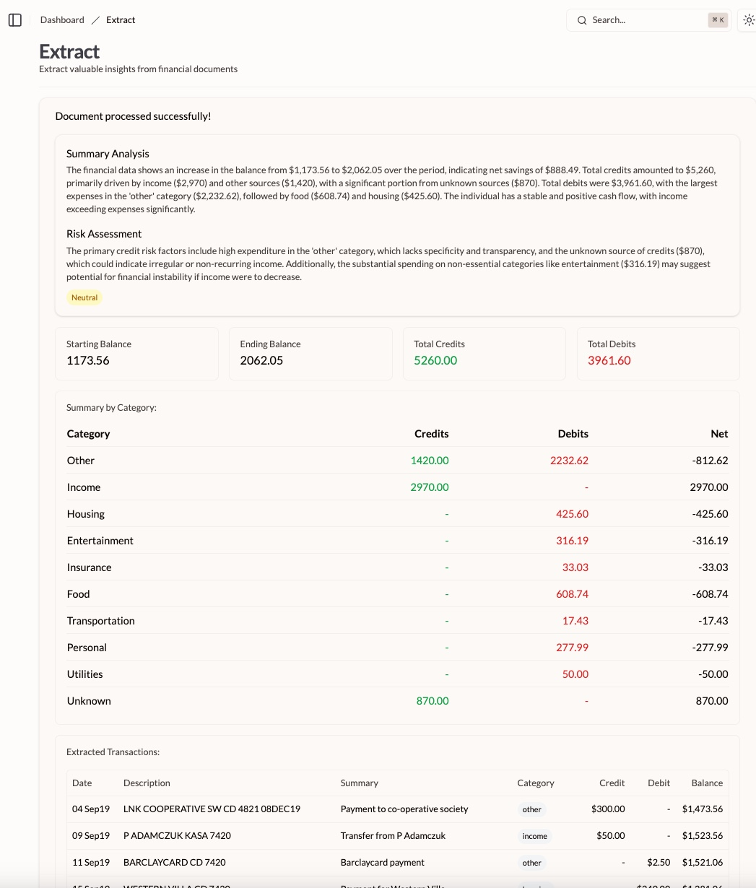

# Bank Statement Extraction

A web application for analyzing bank statements, extracting transaction data, and generating creditworthiness assessments.

## Quick Start

1. Clone the repository
2. Install dependencies: `npm install`
3. Start development server: `npm run dev`

## Live Demo

Access the application at [https://financial-data-extract.vercel.app/](https://financial-data-extract.vercel.app/)

### Demo Credentials
- Email: `casca@dtnewman.com`
- Password: `fba!JFU5juv!qvr!qbz`

### Usage Instructions
1. Visit the application URL
2. Log in using the demo credentials
3. Navigate to the "Extract" page
4. Upload a PDF bank statement
5. Follow the on-screen instructions

NOTE: it takes a while to process the data, depending on the size of the file. I recommend using a smaller file for your first test, such as the [bank2 (2 pages).pdf](https://github.com/dtnewman/financial-data-extract/raw/refs/heads/main/sample_files/bank2 (2 pages).pdf) file in the `sample_files` folder.

## Current Limitations

- PDF format support only
- Single API request to OpenAI (size/token limitations)
- Basic OCR capabilities via OpenAI's vision models
- Limited error handling
- Restricted dataset (single user, single month)

## Future Improvements

1. **Enhanced Data Processing**
   - Support for multiple file formats
   - Batch processing for large PDFs
   - Integration with specialized OCR services (e.g., Amazon Textract)

2. **Robust Error Handling**
   - File validation
   - Size limit management
   - API error handling

3. **Extended Dataset**
   - Ingest multiple bank statements for a single user
   - Combine with other data sources for that user
   - Combine with external data sets
   - Create specialized ML models

4. **Async Processing**
   - Process large files in the background
   - Provide progress updates to the user (e.g. via email)
   - Store results in a database for later retrieval

In general, there isn't enough data to build a robust ML model since we only have a single bank statement for a single user for a single month, so we're using OpenAI's API extensively. In reality, there are many existing models for credit risk assessment and external data sets that could be used to improve the model.
